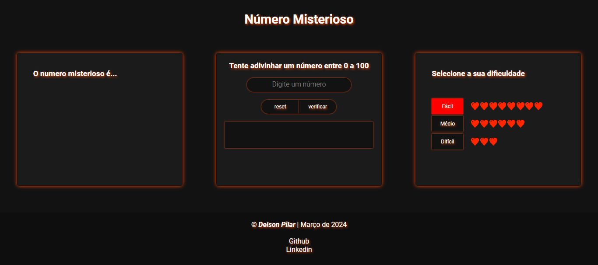

# Jogo do Número Misterioso

Este projeto foi desenvolvido com o propósito de desenvolver um jogo simples utilizando JavaScript. O jogo consiste em um sistema que desafia o jogador a adivinhar um número misterioso dentro de um intervalo entre 0 e 100. O usuário digita um valor e recebe feedback indicando se o valor é maior ou menor que o número secreto.

## Tecnologias Utilizadas

 

## Capturas de tela

